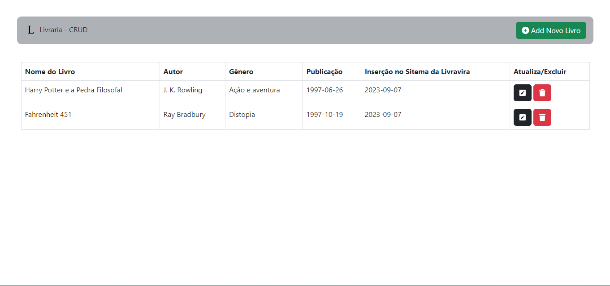

# CRUD - Livraria

Este projeto foi criado com o intuito de estudar JavaScript junto ao PHP.
Desenvolver as funcionalidades de criar, ler, atualizar e deletar traz diversos benefícios para o desenvolvedor web, tanto em termos profissionais quanto pessoais. Criar este projeto foi uma forma de praticar minhas habilidades, mostrar meu trabalho e aprende mais.

**Para este projeto, usei meu conhecimentos em html, css, JavaScript e PHP**

## Tech
- [Bootstrap](https://getbootstrap.com/docs/5.2/getting-started/introduction/) - Para a estrutura do CSS.
- [PHP](https://www.php.net/manual/pt_BR/) - Backend.
- [jQuery](https://jquery.com/) - load() um método AJAX.
